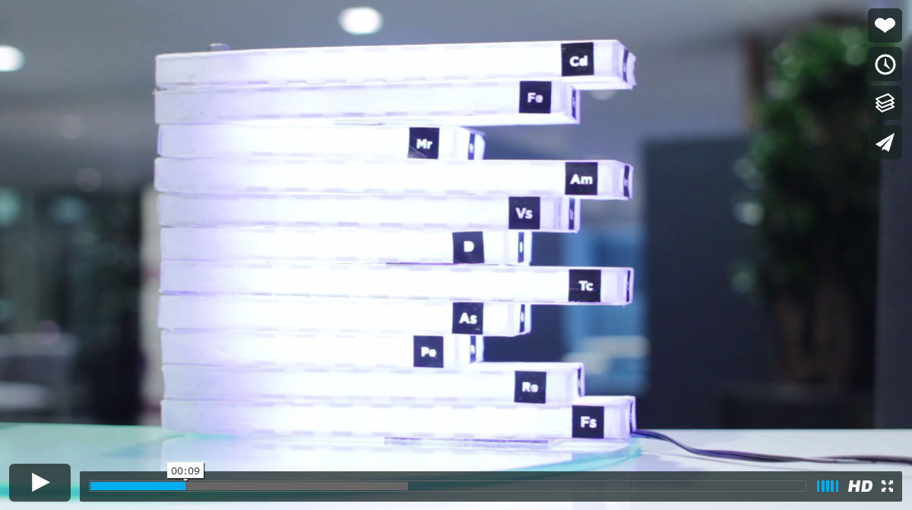

# Graf
The financial technology company **Cinnober** held a makeathon challange together with Sliperiet in Umeå, 2016. They wanted to explore new ways of displaying data without a screen, and we came up with the idea of **Graf**. An in-office sculpture that shows complex server behaviour and flows for the technicians. 

This is the Arduino code for the prototype we showed at the challenge. Keep in mind that this was a limited time makeathon so it's not the most beutiful code, but we could at least show the functionality! 

The Graf prototype is made of one small servo and a bunch of WS2812 led's. I used the Adafruit Neopixel library for the led-functionality. 

[Vimeo Link](https://vimeo.com/158194093)

More information about the makeathon can be found [here](http://www.cinnober.com/news/students-make-financial-data-physical-makeathon)

My lovely team: 
[Alice Baggio](https://se.linkedin.com/in/alicebaggio/en) - [James Zhou](https://www.linkedin.com/in/zhouj) - [Evgenia Kateroudaki](https://gr.linkedin.com/in/evgenia-kateroudaki)
